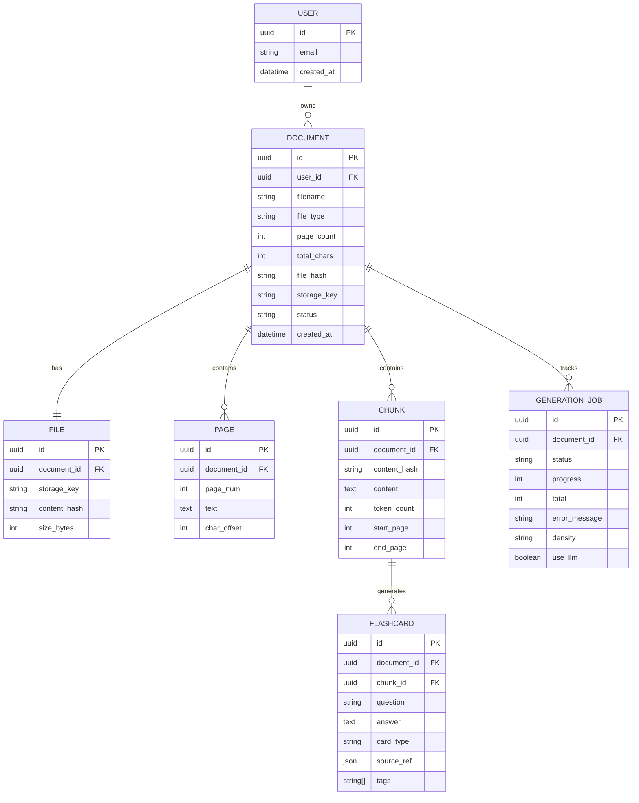
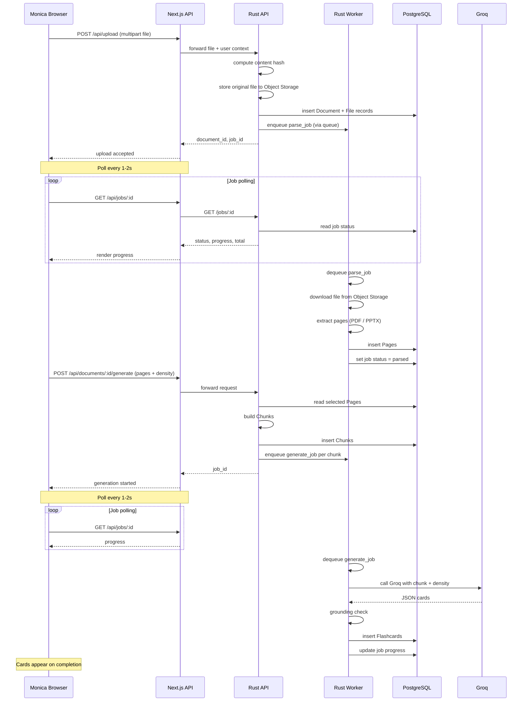

# auto-flashcard architecture

## Goals

1. Accept PDF or PowerPoint files, convert them into indexed text, and generate flashcards.
2. Reloading/revisiting the app restores previously uploaded files (no re-upload).
3. Reloading/revisiting the app restores generated flashcards.

## High-level architecture

## Data model

## Upload → generate sequence

## Implementation plan

1. **Scaffold projects**
   - `api/` — Rust Axum service.
   - `web/` — Next.js App Router.

2. **Port existing Rust logic**
   - Reuse PDF/Markdown parsers from the native app.
   - Add HTTP routes: `POST /upload`, `GET /documents`, `GET /documents/:id`, `POST /documents/:id/generate`, `GET /jobs/:id`.
   - Keep LLM generation logic on the server; read `GROQ_API_KEY` from `.env`.

3. **Persistence (MVP: SQLite + filesystem)**
   - `Document`, `File`, `Page`, `Chunk`, `GenerationJob`, `Flashcard` tables.
   - Original files stored on disk in `api/data/uploads`.
   - Content-hash uploads to skip duplicate parsing.

4. **Frontend**
   - File upload page with drag-and-drop.
   - Document list + detail view showing extracted pages.
   - Page/density selection and generate button.
   - Flashcard list with flip/shuffle.
   - Polling for job progress.

5. **Auth**
   - Start simple (single-user password cookie for Monica).
   - Leave schema/user table in place for proper auth later.

6. **Later improvements**
   - PostgreSQL + S3/R2 object storage.
   - Message queue (Redis/BullMQ or SQS) for parse/generate jobs.
   - PowerPoint parsing.
   - Real-time progress via SSE if needed (not WebSockets, due to Vercel).

## Key decisions

- **Rust stays the backend**: We keep the existing parser/LLM code as a service rather than rewriting it in TypeScript.
- **Vercel for the frontend**: Easy to share with Monica.
- **Polling for progress**: WebSockets are not viable on Vercel; SSE is possible but overkill for single-user progress bars.
- **Separate repos**: `auto-flashcard` (web) and `flashcards` (native SvelteKit/Tauri) remain independent.

## Files

- `docs/architecture.html` — interactive Mermaid diagrams.
- `docs/architecture.png` — rendered screenshot.

---

## Evolution log

### 2026-06-24 — From generator to personalized study platform

This entry records the architecture decisions made after reviewing the current
state of the repo and deciding what to build next. It does not replace the
original architecture above; it extends it.

#### Decision

Turn **auto-flashcard** from a single-user flashcard generator into a
multi-user, personalized study platform. The minimum viable transformation is
the combination of **identity + spaced repetition + card lifecycle + decks**.
Everything else (sharing, export/import, observability, PWA) builds on those
primitives.

Card lifecycle is intentionally scheduled before auth (Phase 1 vs Phase 2) so
Monica gets edit/delete/regenerate capabilities immediately without waiting for
the full auth integration.

#### Adjusted component map

| New / modified module | Responsibility |
| --------------------- | -------------- |
| `api/src/auth.rs` | Magic-link tokens, session cookies, `require_user` extractor |
| `api/src/db.rs` | `users`, `decks`, `deck_cards`, `card_reviews`, `card_flags`; user-scoped queries |
| `api/src/srs.rs` | Pure SM-2-lite scheduler |
| `api/src/export.rs` | CSV, JSON, and Anki `.apkg` serialization |
| `api/src/import.rs` | CSV, JSON, and Anki `.apkg` ingestion |
| `api/src/spend.rs` | Per-user LLM usage tracking and soft cap |
| `api/src/metrics.rs` | `/metrics` endpoint for operational signals |
| `src/lib/auth.ts` | `useUser()` hook, session redirect logic |
| `src/app/login/page.tsx` | Magic-link email form |
| `src/app/review/page.tsx` | SRS daily review session |
| `src/app/decks/page.tsx` | Deck library |
| `src/components/CardEditor.tsx` | Inline card edit, delete-with-undo, flag |
| `src/components/DeckList.tsx` | Deck list with card/due counts |
| `src/components/ReviewStats.tsx` | Session summary + streak widget |
| `src/components/ExportMenu.tsx` | Export format selector |
| `src/hooks/useCardMutations.ts` | Card CRUD + optimistic updates |
| `src/hooks/useDecks.ts` | Deck queries/mutations |
| `src/hooks/useReview.ts` | Due-queue and review mutation |

#### Data-flow additions

1. **Auth**: `POST /auth/magic-link` → email → `GET /auth/callback` sets
   `HttpOnly` `sid` cookie → `require_user` extractor scopes every route.
2. **Review**: `GET /review/due?deck=:id` returns due cards → user flips and
   rates → `POST /cards/:id/review` → `srs.rs` computes next `due_at`.
3. **Card lifecycle**: `PATCH/DELETE /cards/:id` with soft-delete; deleted cards
   are excluded from due queries and deck stats.
4. **Decks**: `deck_cards` junction allows cards from multiple documents to be
   grouped into a study set.
5. **Export / import**: `GET /decks/:id/export?format=...` streams files;
   `POST /decks/:id/import` ingests new cards with preview.

#### New risks and mitigations

| Risk | Mitigation |
| ---- | ---------- |
| Magic-link auth depends on an email sender | Choose Resend/SES with a fallback; test with Mailhog/stdout in dev |
| Cross-origin cookies are fragile | Use `SameSite=None; Secure` in prod, relaxed dev config, and CSRF tokens |
| SRS defaults may feel wrong | Produce `docs/srs-spec.md` in a spike; ship a "reset deck" escape hatch |
| Per-user LLM spend tracking is approximate per provider | Track best-effort tokens and warn/fallback rather than hard-cut mid-job |
| SQLite won't scale past ~10 concurrent writers | Define load-test thresholds in `docs/scaling-plan.md`; migrate to PostgreSQL when crossed |
| Anki `.apkg` export is fiddly | Ship CSV/JSON first; `.apkg` as a follow-up |

#### Decisions that need input (tracked as spikes)

- SRS scheduling defaults: #4
- Deck/document relationship and deletion semantics: #5
- Email provider + cookie/CSRF strategy: #6
- SQLite → PostgreSQL thresholds: #7

#### Roadmap snapshot

The canonical roadmap lives in `README.md`. Issues are tracked in GitHub under
milestones `Spikes`, `Phase 0 — Prep`, `Phase 1 — Card lifecycle`,
`Phase 2 — Auth & per-user isolation`, `Phase 3 — Decks & targeted generation`,
`Phase 4 — SRS`, `Phase 5 — Portability`, and `Phase 6 — Shareability & polish`.
