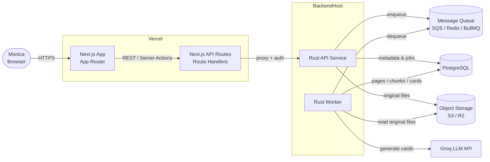
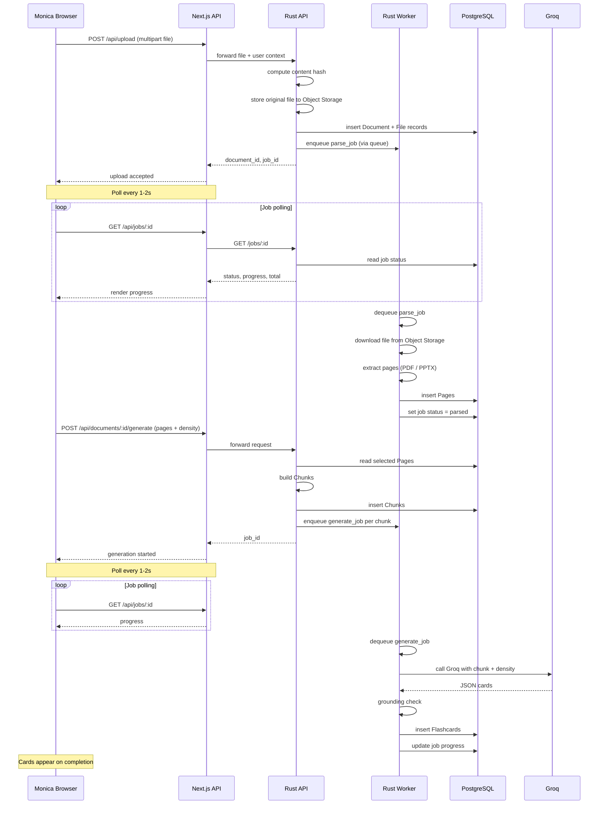

# auto-flashcard architecture

## Goals

1. Accept PDF or PowerPoint files, convert them into indexed text, and generate flashcards.
2. Reloading/revisiting the app restores previously uploaded files (no re-upload).
3. Reloading/revisiting the app restores generated flashcards.

## High-level architecture

## Data model

## Upload → generate sequence

## Implementation plan

1. **Scaffold projects**
   - `api/` — Rust Axum service.
   - `web/` — Next.js App Router.

2. **Port existing Rust logic**
   - Reuse PDF/Markdown parsers from the native app.
   - Add HTTP routes: `POST /upload`, `GET /documents`, `GET /documents/:id`, `POST /documents/:id/generate`, `GET /jobs/:id`.
   - Keep LLM generation logic on the server; read `GROQ_API_KEY` from `.env`.

3. **Persistence (MVP: SQLite + filesystem)**
   - `Document`, `File`, `Page`, `Chunk`, `GenerationJob`, `Flashcard` tables.
   - Original files stored on disk in `api/data/uploads`.
   - Content-hash uploads to skip duplicate parsing.

4. **Frontend**
   - File upload page with drag-and-drop.
   - Document list + detail view showing extracted pages.
   - Page/density selection and generate button.
   - Flashcard list with flip/shuffle.
   - Polling for job progress.

5. **Auth**
   - Start simple (single-user password cookie for Monica).
   - Leave schema/user table in place for proper auth later.

6. **Later improvements**
   - PostgreSQL + S3/R2 object storage.
   - Message queue (Redis/BullMQ or SQS) for parse/generate jobs.
   - PowerPoint parsing.
   - Real-time progress via SSE if needed (not WebSockets, due to Vercel).

## Key decisions

- **Rust stays the backend**: We keep the existing parser/LLM code as a service rather than rewriting it in TypeScript.
- **Vercel for the frontend**: Easy to share with Monica.
- **Polling for progress**: WebSockets are not viable on Vercel; SSE is possible but overkill for single-user progress bars.
- **Separate repos**: `auto-flashcard` (web) and `flashcards` (native SvelteKit/Tauri) remain independent.

## Files

- `docs/architecture.html` — interactive Mermaid diagrams.
- `docs/architecture.png` — rendered screenshot.
